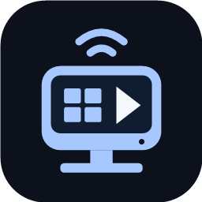

<h1 align="center">WinPlay</h1>

让Windows电脑成为无线CarPlay接收端，通过本机移动热点或现有局域网显示画面、播放音频并操作iPhone的CarPlay界面。

  
  
  
  

  
  
  
  
  
  

<a href="#快速入门">快速入门</a> · <a href="#主要功能">主要功能</a> · <a href="#音频与系统媒体控件">音频与媒体</a> · <a href="#常见问题">常见问题</a> · <a href="#其他平台">其他平台</a> · <a href="#从源码构建">源码构建</a> · <a href="#来源与许可">来源与许可</a>

其他设备：<a href="https://github.com/Roylyl/MacPlay">MacPlay</a> · <a href="https://github.com/Roylyl/AndroidPlay">AndroidPlay</a>

WinPlay适合把Windows笔记本、平板或桌面显示器作为CarPlay屏幕使用。当前提供无线连接，支持本机移动热点和现有局域网两种方式。

## 快速入门

### 使用条件

- Windows10/11x64，具备蓝牙与Wi-Fi能力。
- 支持CarPlay的iPhone，以及能被iPhone接受的配件认证材料。
- 本机移动热点，或允许设备互访的共用Wi-Fi。

安装包内置Electron、Node.js和Windows平台桥接，普通用户无需安装开发工具。当前提供本地构建的`WinPlay-1.1.0-Setup-x64.exe`，生成方法见[从源码构建](#从源码构建)。

### 安装与连接

1. 运行`WinPlay-1.1.0-Setup-x64.exe`，按向导完成安装并打开WinPlay。当前安装包尚未做发行代码签名。
2. 在“诊断”页确认认证文件已就绪；需要替换时，导入配套的`identity.pk8`和`certificate.p7b`。认证材料的使用前提见[认证与数据](#认证与数据)。
3. 在Windows蓝牙设置中配对iPhone，再回到“连接”页刷新并选择设备。
4. 选择“本机移动热点”或“现有局域网”，填写SSID、共享密码和实际信道，确认自动推荐的网卡。
5. 点击“启动接收”，在iPhone上允许CarPlay。独立画面窗口立即打开，等待视频时显示黑色。
6. 修改连接、显示或音频设备设置后，点击“应用并重新连接”。

| 无线模式 | 如何准备网络 | 接口选择 |
| --- | --- | --- |
| 本机移动热点 | 在Windows设置中开启热点，让iPhone加入 | 活动热点共享接口或Wi-FiDirect虚拟接口 |
| 现有局域网 | Windows与iPhone加入同一Wi-Fi，填写路由器共享密码 | 对应物理网络接口，可填写路由器BSSID |

两种模式分别保存配置，应用自动推荐网卡并保留有效的同模式手动选择。热点未开启时需先开启再刷新；局域网模式可读取当前SSID、信道和Windows保存的共享密码。企业认证、网页登录或客户端隔离可能阻止连接，防火墙需允许两端互访与Bonjour多播。

完整操作见[使用教程](docs/使用教程.md)。停止接收不会关闭Windows移动热点。

## 主要功能

| 功能 | 使用体验 |
| --- | --- |
| 无线双模式 | 本机移动热点与现有局域网分别保存配置，自动推荐对应网卡 |
| 独立CarPlay窗口 | 默认1280×720、60fps，按屏幕物理像素显示，保持画面比例 |
| 多屏与分辨率 | 选择显示器、分辨率预设或自定义像素，支持全屏窗口化 |
| 鼠标与触控板 | 支持点击、拖动及上下/左右滚动 |
| 音频播放 | 音乐按协商延迟缓冲并重排，直接输出到所选音频设备 |
| 音量与设备 | 媒体与通话音量实时调节，输入/输出设备默认跟随系统 |
| Windows媒体控件 | 同步可获取的媒体信息，支持播放/暂停、切歌与进度跳转 |
| 封面按需同步 | 歌词照常更新，相同封面不重复同步，连续封面变化合并处理 |
| 系统托盘 | 隐藏窗口后保持连接，通过托盘恢复画面或退出 |

主界面分为连接、显示、音频和诊断四页，支持浅色、深色与跟随Windows外观。主题只影响WinPlay设置界面，CarPlay外观由iPhone决定。主动停止或会话断开后，画面窗口关闭，主界面恢复“启动接收”。

## 其他平台

使用Windows电脑时选择WinPlay；需要Mac上的USB直连，或希望使用Android手机、平板和车机时，可以选择下面的项目。

| 项目 | 平台 | 适合的使用场景 |
| --- | --- | --- |
| [MacPlay](https://github.com/Roylyl/MacPlay) | macOS14及以上 | 适合Mac用户。支持USB直连和共用Wi-Fi无线连接，提供原生设置界面、多屏显示与系统媒体控件。 |
| [AndroidPlay](https://github.com/Roylyl/AndroidPlay) | Android9及以上 | 适合Android手机、平板和车机。通过系统热点与蓝牙连接iPhone，提供全屏画面、音频和通知栏媒体控制。 |

## 显示与操作

首次安装默认1280×720、60fps。分辨率可选屏幕原生像素、1280×720、1920×1080、2560×1440和自定义；“请求像素”随选择更新，应用后才重新协商。

普通CarPlay窗口可以移动，不能拖动调整大小；画面区域按物理像素设置，Windows缩放不会放大窗口，视频保持比例并在剩余区域留黑边。原生像素或屏幕最大分辨率采用全屏窗口化，Esc与Win+D可隐藏画面到系统托盘，通过托盘菜单恢复。超出所选屏幕可用区域时明确报错。

帧率可选30/60/90/120fps。120启动失败后尝试90，再失败尝试60；请求帧率、本次尝试、实际收到和实际解码帧率分别显示，屏幕刷新率不作为视频帧率。高帧率是请求上限，实际输出由iPhone、网络和解码能力决定。

首次关闭主窗口时可选择退出或最小化到托盘，并勾选“不再提示”；之后可在“显示→窗口行为”修改。点击托盘图标恢复主窗口，右键菜单可显示CarPlay画面或退出应用。最小化保持连接，退出会停止接收。

关闭CarPlay画面窗口时，会询问是否断开与iPhone的连接；取消后保持连接，确认后停止接收。iPhone主动断开时，画面窗口自动关闭。

## 音频与系统媒体控件

### 播放与设备

媒体音量、通话音量和播放开关实时生效。输入/输出默认跟随系统，也可分别选择；切换设备后点击“应用并重新连接”。麦克风访问需要Windows权限，拒绝授权仍可接收画面和播放声音。

音乐使用48kHz立体声AAC传输，实际编码码率由iPhone决定，音频页显示实际协商格式。WinPlay直接向所选Windows音频设备输出声音，不经过额外的实时媒体流播放器。

音乐先按协商延迟缓冲、重排音频包，再在临近播放时解码。常见的1000毫秒音乐缓冲会保留，起播可能有短暂等待；导航和通话使用较短缓冲。迟到音频不会通过加速播放追赶，暂停、恢复或音频时间戳重新开始时会重建播放时间线。

### 系统媒体控件

Windows系统媒体控件显示iPhone上报的播放状态、标题、歌手、专辑、封面与进度，并支持播放/暂停、上一首、下一首和播放器允许的进度跳转。音乐App没有上报的信息可能为空。

### 歌词与封面

部分音乐App会把歌词写入歌名字段。WinPlay照常同步这些文字，不把歌词或专辑文字变化当作切歌，封面独立按需更新：

- 确认切歌后清除旧封面，收到新曲目的首张封面立即显示。
- 相同图片不重复同步，歌词更新不重新携带已有封面。
- 同一首歌内连续变化的封面最多每5秒更新一次，期间保留最新一张。

这些处理减少WinPlay内部的数据复制、界面刷新和系统媒体控件更新；iPhone已经发送的封面数据仍需接收。

## 认证与数据

本地安装包使用构建者提供的`identity.pk8`与`certificate.p7b`。诊断页可以导入替换，本机导入文件优先。格式和公钥需匹配，最终认证由iPhone决定；公开分发前应确认认证材料授权，或移除内置文件并要求用户导入，见[NOTICE](NOTICE)。

配置、导入认证文件与CarPlay配对身份保存在`%APPDATA%\WinPlay\data`，敏感数据使用WindowsDPAPI保护。诊断导出不包含Wi-Fi密码、手机地址或配对密钥；卸载保留用户数据。

## 常见问题

| 现象 | 处理方法 |
| --- | --- |
| 热点模式没有推荐网卡 | 先开启Windows移动热点，再刷新网络接口 |
| 蓝牙列表没有iPhone | 在Windows系统设置中完成配对后刷新设备列表 |
| 画面窗口打开后仍为黑色 | 查看连接状态，检查认证、网络接口、SSID、密码和防火墙 |
| 自定义窗口无法启动 | 调整为能放入所选屏幕的分辨率，或选择原生像素模式 |
| 媒体进度不能拖动 | 播放器需上报有效时长并允许跳转 |
| 歌名不断变化，但封面保持不变 | 音乐App可能通过歌名字段发送歌词，这是正常行为 |
| 同一首歌的封面没有立即变化 | 连续封面更新会合并，最多每5秒同步一次；新曲目的首张封面立即显示 |
| 音乐开始播放前有短暂等待 | 音乐会先建立缓冲，常见协商延迟为1000毫秒 |
| 音频变速变调、断续或爆音 | 在音频页确认输出设备，应用并重新连接；若仍出现异常，按下方说明导出诊断 |

遇到持续的音频异常，可在“诊断”页查看“音频运行统计”并导出记录。反馈时附上WinPlay版本、无线模式、输出设备及连接方式（如电脑扬声器、DP/HDMI显示器、有线耳机或蓝牙耳机），说明异常是变速变调、断续还是爆音，以及出现的大致时间。统计在发生异常计数时更新，包含迟到包、缺失包、缓冲恢复和时间戳重置情况。

问题反馈：[GitHub Issues](https://github.com/Roylyl/WinPlay/issues)。请勿附带Wi-Fi密码或认证私钥。

## 从源码构建

在Windows项目根目录使用Node.js24与npm，Windows自带.NETFramework的C#编译器用于平台桥接。首次下载依赖、运行时和.NETFramework编译参考程序集需要联网：

~~~powershell
npm ci
powershell -NoProfile -ExecutionPolicy Bypass -File scripts/fetch-runtime.ps1
npm run build
npm start
~~~

打包前在`resources/authentication`放入有权使用的认证文件，然后执行：

~~~powershell
npm run dist
~~~

生成`dist/WinPlay-1.1.0-Setup-x64.exe`，成功后复制到Windows桌面。当前交付脚本随后通过官方卸载程序清理已有WinPlay安装，保留用户数据；不生成源码ZIP。

`src/engine`负责无线引导与网络协议，`src/ui`负责设置、画面和音频，`native/Platform.cs`负责Windows蓝牙、窗口物理像素及数据保护，`native/MediaBridge.cs`负责Windows系统媒体控件。认证文件、运行时、依赖缓存和构建产物已由.gitignore排除。

## 来源与许可

无线引导参考[AndroidPlay](https://github.com/Roylyl/AndroidPlay)，局域网方案和网络协议复用[MacPlay](https://github.com/Roylyl/MacPlay)，保留LIVI、LasseHeitgres及贡献者和DiPlay来源声明。项目沿用GPL-3.0-or-later，见[LICENSE](LICENSE)、[NOTICE](NOTICE)和[第三方声明](vendor/THIRD-PARTY-NOTICES.txt)。

WinPlay是独立衍生项目，不代表Apple或上游作者，不声称获得MFi认证。第三方组件、认证证书、私钥和商标继续适用各自权利条件。
